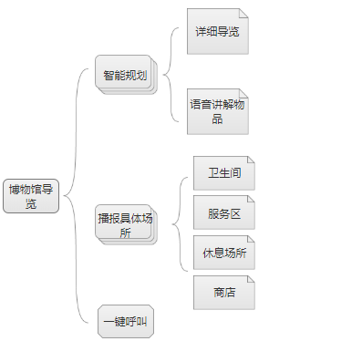
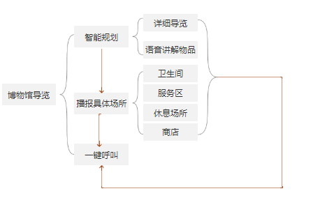

# 博物馆产品需求文档
|产品的PRD设计|原型设计|机器学习之API的输出入展示
|---------- | --- |---------- 
|[PRD1-加值宣言](#chapter1) |[产品功能架构](#chapter13)|[API输入与输出](#chapter16)
|[PRE2-核心价值](#chapter2) |[流程图](#chapter14)|[API1.使用水平](#chapter17)
|[PRD3-用户痛点宣言](#chapter3) |[原型1.交互及界面设计](#chapter15)|[API3.使用后风险报告](#chapter18)
|[产品简介](#chapter4) | [原型2.信息设计](#chapter15)|[API4.加分项](#chapter19)
|[产品背景](#chapter5) |[原型3.原型文档](#chapter15)|----------
|[产品目标](#chapter6) |[原型下载的地址](#chapter15)|---------- 
|[用户画像](#chapter7) | |---------- 
|[目标用户](#chapter8) ||---------- 
|[用户需求](#chapter9) ||---------- 
|[情景假设](#chapter10) | --- |----------
|[PRD4-人工智能概率性与用户痛点](#chapter11) | --- |---------- 
|[PRD5-需求列表与人工智能API加值](#chapter12)| --- |---------- 
|| --- |----------

## 产品的PRD设计
<h3 id="chapter1">一、PRD1-加值宣言 </h3>

- 该产品还调用了人流量统计api的价值在于：
> 为残障人士规划和推荐最佳的路线。避免因为拥堵而造成的不便。

- 该产品调用语音合成API的价值在于：
> 为残障人士进行物品介绍进行语音播报，避免因解说文字的距离和高度问题而无法尽情的浏览的烦恼。而且有明确的指导，能快速且准确的到达解决身心需求的区域

- 该产品调用百度API的价值在于：
> 除为残障人士提供智能的游览线路外，还需要提供休息、饮食、洗手间等解决生理需求的区域的导航，减少残障人士因为身体原因以及对展区不熟悉带来的不方便。

<h3 id="chapter2">二、PRD2-核心价值</h3>

- 为残障人士推荐浏览的最佳路线，结合百度地图，在浏览的过程中到达特定区域时，对物品进行语音播报或文本呈现，还提供休息、饮食、洗手间等解决生理需求的区域的导航，减少残障人士因为身体原因以及对展区不熟悉带来的不方便。
- 在观览过程中感到不适或者需要寻求帮助时只需要一键求助.

<h3 id="chapter3">三、PRD3-用户痛点宣言</h3>

- 残障人士参观博物馆时，无法避免因访客多而无法尽情的浏览物品的情况。
- 有时候物品的解说放的位置让残障人士不方便阅读，他们只能观看物品，这样给他们的体验感很差。
- 在寻找解决身心需求的区域总是困难重重，要不不知道在哪，要么不知怎么去。

<h3 id="chapter4">四、产品简介</h3>

- 该产品可以为残障人士提供最的浏览路线，尽量避开人流量较多的区域。
- 该产品提供休息、饮食、洗手间等解决生理需求的区域的导航，减少残障人士因为身体原因以及对展区不熟悉带来的不方便。
- 该产品结合地图，为残障人士就特定区域的物品的介绍进行语音播报或文本呈现；

<h3 id="chapter5">五、产品背景</h3>

- 残障人士是一个特殊的社会群体，他们本身的不便导致于在进行社会活动时困难重重。
- 残障人士一般不想出门游玩的理由就是没有能够规划最佳出行路线的系统或者软件。当他们在游玩或是观赏时，总是存在因为物品的位置和距离导致自己扫兴而归的问题。

<h3 id="chapter6">六、产品目标</h3>

- 为他们在浏览时推荐最佳路线，既能避免人多给他们带来安全隐患，还能让他们尽情的观赏。
- 还提供休息、饮食、洗手间等解决生理需求的区域的导航，减少残障人士因为身体原因以及对展区不熟悉带来的不方便。
- 在观赏的过程提供语音播报或者文本呈现，避免他们因物品解说词的距离和高度的问题而苦恼。
- 在观览过程中感到不适或者需要寻求帮助时只需要一键求助.

<h3 id="chapter7">七、用户画像</h3>

类别 | 详情
---|---
群体 | 残障人士
日常 |  出行游玩、观赏
痛点 | 1、无法最大程度避开人流，尽情的观赏和游玩；2、一些物品的位置和距离让他们无法了解更多。3、在遇到困难时，无法总是第一时间找到工作人员。

<h3 id="chapter8">八、目标用户</h3>

- 残障人士。
> 残障人士：
> - 定义：游由于残损或残疾程度严重，身心功能严重障碍，不但个人生活不能自理，而且影响参加社会生活和工作，“残疾人士”包含“残障人士”，只是“残障人士”专指严重程度的残疾人，生理功能部分或完全丧失。
> - 痛点：生理功能部分或完全丧失,在参观展览的时候可能会出现以下问题，心智障碍，无法理解遵守博物馆相关规定；视觉障碍，无法通过视觉感知博物馆藏品；听觉障碍，无法接受语音信息；哑巴，无法通过语言向展区工作人员寻求帮助，身体障碍，身体移动不方便，无法长时间游览展区。

<h3 id="chapter9">九、用户需求</h3>

- 需要一个智能的路线推荐系统，基于人流量统计的数据，为残障人士智能的推荐游览的最佳路线，避免高峰期发生安全事故的可能，提升残障人士的用户体验。

- 需要可以实时解说物品的功能，避免因位置和高度等问题而带来的困扰。
- 需要有明确的指导，为他们快速且准确的到达解决身心需求的区域。

<h3 id="chapter10">十、情景假设</h3>

|名字|身份|面临的问题|
| ---------- | --- |----------- |
|小刘|身体障碍|因腿不方便所以需要乘坐轮椅，到哪里都需要借助轮椅出行。
|小李|身体障碍|因意外失去双手的小李，无法和正常人一样使用手机，只能进行简单的按钮操作。
|小郑|视力障碍|小郑因视力障碍无法看到细小和距离较远的东西，常常需要放大字号和借助语音播报来辅助自己。

<h3 id="chapter11">十一、PRD4-人工智能概率性与用户痛点</h3>

###### 人工智能概率性
- 目前人类对ImageNet图像的识别错误率大约在5%，微软的人工智能系统的错误率为4.94%，谷歌为4.8%。百度在2015年的时候已将这一错误率进一步降至4.58%，实现了质的飞跃。
- [百度超级计算机图像识别超人类水平 错误率低于微软谷歌](http://tech.ifeng.com/a/20150512/41080218_0.shtml)

###### 用户痛点

- 残障人士参观博物馆时，无法避免因访客多而无法尽情的浏览物品的情况。
- 有时候物品的解说放的位置让残障人士不方便阅读，他们只能观看物品，这样给他们的体验感很差。
- 在寻找解决身心需求的区域总是困难重重，要不不知道在哪，要么不知怎么去。

<h3 id="chapter12">十二、PRD5-需求列表与人工智能API加值</h3>

|优先级|用户需求|功能实现|api加值|
| ---------- | --------- |----------- |-----------|
|重要|推荐游览的最佳路线|智能规划|人流量统计API
|次重要|实时解说物品|语音播报功能|语音合成API
|次重要|有明确的指导，能快速且准确的到达解决身心需求的区域|语音合成API

## 原型设计
<h3 id="chapter13">一、产品架构图</h3>

<h3 id="chapter14">二、产品流程图</h3>

<h3 id="chapter15">四、Axure原型文档交互展示</h3>

### [原型1.交互及界面设计](http://nfunm104.gitee.io/api_museum)
### [原型2.信息设计](http://nfunm104.gitee.io/api_museum)
### 产品原型
### [原型3.原型文档](http://nfunm104.gitee.io/api_museum)
### [原型下载的地址](https://gitee.com/NFUNM104/API_museum)

## API的输出入展示

<h3 id="chapter16">一、API输入与输出</h3>

- 人流量统计api：
> 为残障人士规划和推荐最佳的路线。避免因为拥堵而造成的不便。
##### [详细代码示例](https://github.com/zhengxiaopingzxp/API_ML_PM_museum/blob/master/tongji.ipynb)

该产品调用语音合成API的价值在于：
> 为残障人士进行物品介绍进行语音播报，避免因解说文字的距离和高度问题而无法尽情的浏览的烦恼。而且有明确的指导，能快速且准确的到达解决身心需求的区域
##### [详细代码示例](https://github.com/zhengxiaopingzxp/API_ML_PM_museum/blob/master/%E8%AF%AD%E9%9F%B3%E5%90%88%E6%88%90.ipynb)

<h3 id="chapter17">二、API1.使用水平</h3>

- 输入：智能规划；输出：两条以上的最佳游览路线
- 输入：语音播报；输出：实时播报
- 输入：卫生间、休息区等公共领域；输出：具的到达路线

##### [所有代码示例](https://github.com/zhengxiaopingzxp/API_ML_PM_museum)

<h3 id="chapter18">四、API3.使用后风险报告</h3>

> 人流量统计api:
- 在博物馆的高峰期，无法真正准确推荐最佳路线。
> 语音合成api：
- 存在播报信息不及时、有错误等情况。

<h3 id="chapter19">五、API4.加分项</h3>

- 用到的的api有人流量统计api、语音合成apiapi、百度地图api
##### [人流量统计代码示例](https://github.com/zhengxiaopingzxp/API_ML_PM_museum/blob/master/tongji.ipynb)
##### [语音合成代码示例](https://github.com/zhengxiaopingzxp/API_ML_PM_museum/blob/master/%E8%AF%AD%E9%9F%B3%E5%90%88%E6%88%90.ipynb)

